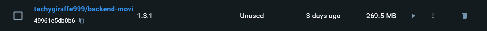
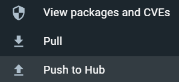
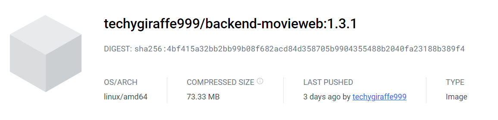

# Making the Docker Image

If you do not want to use the current Docker Image which has been used in the tutorial which is on Movie Web Backend version 1.3.1 you can make your own and use it for your backend!

:::warning

**This is not reccomended for most users**

::: 

## Prerequesites
- Have [**docker**](https://www.docker.com/products/docker-desktop/) installed
- Have the [**Movie Web Backend**](https://github.com/movie-web/backend) **cloned**

## Creating the image


#### 1. Open Docker Desktop and the terminal in the Movie Web Backend root directory
#### 2. Run:

```terminal
docker build -t YOURUSERNAME/backend-movieweb:latest .
```

- ``your-username`` should be replaced with your docker username
- The tag at the end (in this example latest) can be modified to be a version number e.g. ``1.2``. I would reccomend tagging it based on the current Movie Web Backend version.

It should now appear in your ``images`` section of the docker desktop app:

*(Your created date will be ``just now``)*

#### 3. Push Build

The next step is to push your docker build. Select the 3 dots next to your image. And select ``Push to Hub``:
> 

#### 4. Get the link
You should now see a new [repository](https://hub.docker.com/repositories).

Select your Movie Web Backend repository and scroll down to the ``Tags`` Section. 

Click on your tag, and copy the text at the top which is in bold:
> 

**Paste your text into the link below, and congrats you just made your own image!**

``registry-1.docker.io/TEXT-HERE``

