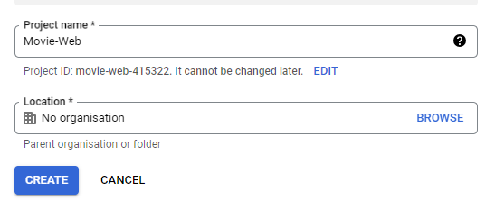
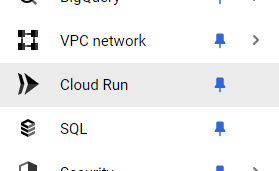

# Create the Project

Once you have opened the [Google Cloud Console](https://console.cloud.google.com) the next step is to create a new project.

#### 1. Go to: https://console.cloud.google.com/projectcreate

#### 2. Give your project a name and select ``create``.

> 

#### 3. Select **Cloud Run** from the sidebar:

> 

#### 4. Select **Create Service**:

> 

