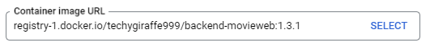
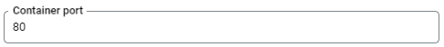
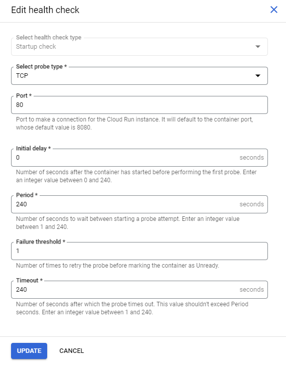

# Creating the Service

The next step is to create the service and deploy it.


#### 1. Modify the ``Container image URL`` to be:
 ```
 registry-1.docker.io/techygiraffe999/backend-movieweb:1.3.1
 ```

> 


#### 2. Select the **closest region** to you with **Tier one pricing**

> 


#### 3. Select ``Allow unauthenticated invocations`` (It is under "Authentication")
#### 4. Click the Dropdown menu button on ``Container(s), Volumes, Networking, Security``
#### 5. Modify the Container Port to be ``80``:
> 

#### 6. Scroll Down and Select ``Add Health Check``. Copy the same format as below:
> 
#### 6. Select Variables and Secrests (It is located slightly below the Port section)
#### 7. Add following necessary variables:
| Name    | Value |
| -------- | ------- |
| MWB_POSTGRES__CONNECTION   | DATABASE URL HERE    |
| MWB_CRYPTO__SESSION_SECRET  | RANDOM 32 DIGIT STRING      |
| MWB_META__NAME    | your-name-here   |
| MWB_POSTGRES__SSL | true |
| MWB_POSTGRES__MIGRATE_ON_BOOT | true |
| MIKRO_ORM_MIGRATIONS_DISABLE_FOREIGN_KEYS | false |
| MWB_SERVER__ALLOW_ANY_SITE | true | 

- The ``MWB_POSTGRES__CONNECTION`` is your prostgresql database link. If you created one earlier on vercel, insert that there.

#### 8. Select Create!
