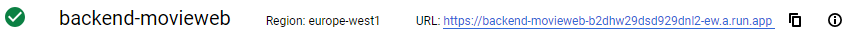
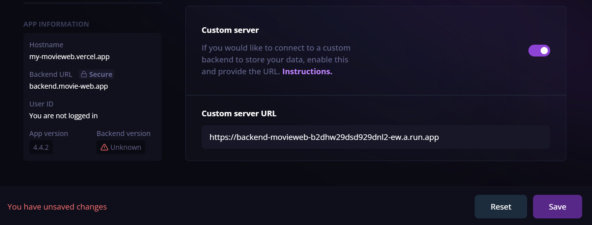

# Link the Backend

Now its time to link the backend back up to your frontend!

Once your Google Cloud run service has finished launching you should have a URL that is shown:
> 
- Make a note or copy that URL

## Method 1 

Method 1 involves linking the backend to your Movie Web frontend globally. This will enable all of your users to be able to use your backend system. 

### __Vercel__
1. Head to your project and select "Settings"
2. Select "Environmental Variables"
3. Add the following environmental variable:

| Key    | Value |
| -------- | ------- |
| VITE_BACKEND_URL   | PASTED BACKEND URL    |

### Non-Vercel Applications

For non vercel applications adding the environmental variable will depend on where and how you are hosting it. The environmental variable you need to add is the same as vercel (``VITE_BACKEND_URL``).

## Method 2

Method 2 involves having the user link the backend system to Movie Web themselves. To do this they will need to open up your Movie Web frontend and:

1. Click on the burger menu in the top right
2. Select Settings
3. Scroll down to Custom Server
4. Paste your backend URL in and hit ``Save``
> 